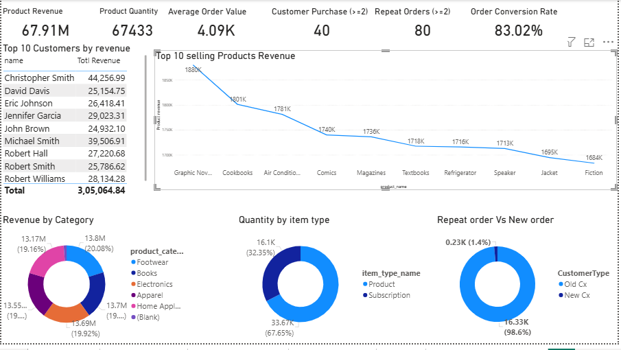

# E-commerce & SaaS Analytics Project

This project demonstrates a complete **E-commerce & SaaS Analytics pipeline** using multiple related tables. The goal is to transform raw transactional, user, and product data into actionable business insights.
---

## **Dataset Overview**

The project uses the following tables:

### **1. Users**
| Column Name       | Description                           |
|------------------|---------------------------------------|
| user_id           | Unique identifier for each user       |
| name              | Name of the user                      |
| email             | Email address of the user             |
| age               | Age of the user                        |
| country_name      | Country of the user                    |
| sign_up_date      | Date when the user signed up           |

### **2. Products**
| Column Name       | Description                           |
|------------------|---------------------------------------|
| product_id        | Unique product identifier             |
| product_name      | Name of the product                   |
| product_category  | Category of the product               |
| unit_price        | Price per unit of the product         |

### **3. Orders**
| Column Name             | Description                          |
|-------------------------|--------------------------------------|
| order_id                | Unique order identifier              |
| user_id                 | User who placed the order            |
| order_purchase_timestamp| Timestamp when the order was placed  |
| order_approved_at       | Timestamp when the order was approved|

### **4. Order Line Items**
| Column Name             | Description                          |
|-------------------------|--------------------------------------|
| order_line_item_id       | Unique identifier for each line item |
| order_id                 | Associated order                     |
| product_id               | Associated product                   |
| product_category_id      | Category of the product              |
| subscription_id          | Associated subscription (if any)     |
| item_type_id             | Item type                             |
| quantity                 | Quantity ordered                      |
| unit_price               | Price per unit                        |

### **5. Subscriptions**
| Column Name | Description                          |
|------------|--------------------------------------|
| subscription_id | Unique identifier for subscription |
| user_id        | Associated user                     |
| plan_id        | Subscription plan ID                |
| start_date      | Start date of subscription          |
| end date       | End date of subscription            |

### **6. Product Categories**
| Column Name       | Description                          |
|------------------|--------------------------------------|
| product_category_id | Unique category identifier          |
| category_name       | Name of the category                |

### **7. User Events**
| Column Name      | Description                          |
|-----------------|--------------------------------------|
| event_id          | Unique event ID                       |
| user_id           | User associated with the event        |
| session_id        | Session ID                            |
| feature_name      | Feature accessed                      |
| event_name        | Type of event (click, view, purchase)|
| event_timestamp   | Timestamp of the event                |
| device_type       | Device used (mobile, desktop)         |
| geo_location      | Geographic location of user           |

### **8. Item Types**
| column_name    | Description                          |
|------------------|--------------------------------------|
| item_type_id       | Unique item type identifier          |
| item_type_name     | Name of the item type                |

---

## **Key Metrics & KPIs**

These metrics are useful for E-commerce, Retail, and SaaS companies:

### **User Metrics**
- **Active Users:** Daily, weekly, monthly active users (DAU/WAU/MAU)  
- **User Growth:** New sign-ups over time  
- **Churn Rate:** Percentage of users not returning  
- **Average Age / Geography Distribution:** Understand audience demographics  

### **Order & Revenue Metrics**
- **Top-Selling Products & Categories**  
- **Average Unit Price & Revenue per Product**  
- **Total Orders / Revenue Over Time**  
- **Average Order Value (AOV)** = Total Revenue / total of distinct Orders  
- **Repeat Purchase Rate** = Users with multiple orders / Total Users  
- **Order Conversion Rate** = Orders ÷ Total Sessions

### **Subscription & SaaS Metrics**
- **Subscription Count by Plan**  = count of subscriptions / plan
- **Monthly Recurring Revenue (MRR)** = SUM(price of active subscriptions)
- **Churn Rate by Plan** = 
- **Average revenue per subscription = total subscription revenue /  total unique subscriptions
- **Average revenue per customer = total subscription reveue  / total unique users
- **Lifetime Value (LTV) per Customer**  

### **Engagement & Event Metrics**
- **Feature Usage Frequency**  
- **Session Count per User**  
- **Event Funnels:** e.g., Product Viewed → Added to Cart → Purchased  
- **Device & Geo Insights**  

### **Other Strategic KPIs**
- **Customer Retention Rate**  
- **Revenue per User (ARPU)**  
- **Category Performance**  
- **Item Type Popularity**  

---

## **Project Goals**
1. Clean and model raw data for analytics.  
2. Generate dashboards with insights for decision-making.  
3. Track key metrics to optimize product, sales, and user experience.  

---

## **Tech Stack** 
- Power BI , Excel

---

This project allows companies to **understand user behavior, product performance, and revenue trends** for making data-driven decisions.

